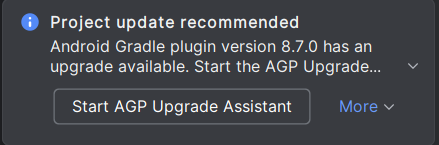

To edit your fork of the quickstart repo, we need to clone it locally so it can be accessed in Android Studio.

1. Move back to tehe Android Studio window
2. Click the "Clone Repository" button
3. In the window that pops up, set the "URL" to the link you copied earlier
4. Click "Clone"
5. Once the repo is cloned, you will get a dialog which asks "Trust and Open Project?", check the "Trust all projects in folder" and "Add to Microsoft Defender exclusion list" boxes, then click "Trust Project"
6. Accept any prompts for administrator permissions and wait for the blue loading bar in the bottom right to go away
!!!warning
You will get this popup during the process. DO NOT CLICK UPGRADE. Click "More", and "Don't show again"

!!!

Everything we need to code is now installed! Now we are going to connect the REV Control Hub to Android Studio for wireless coding.